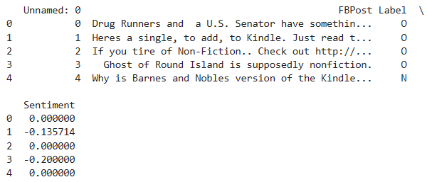
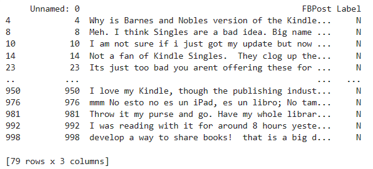

<H3>ENTER YOUR NAME : Shriram R</H3>
<H3>ENTER YOUR REGISTER NO : 212221240053</H3>
<H3>DATE:02.05.2024</H3>
<H1 Align="center">Project Based Experiment<H1>

### Objective:

Perform sentiment analysis using your Facebook data and filter the data that has only negative feedback for the code given in the following link.
  
### Program:
```
pip install pandas textblob
import pandas as pd
from textblob import TextBlob

# Load the CSV file into a DataFrame
df = pd.read_csv('fb_sentiment.csv')

# Function to perform sentiment analysis using TextBlob
def analyze_sentiment(text):
    blob = TextBlob(str(text))
    return blob.sentiment.polarity

# Apply sentiment analysis to each row in the DataFrame
df['Sentiment'] = df['FBPost'].apply(analyze_sentiment)

# Output the DataFrame with sentiment analysis results
print(df.head())

# Filter out rows with negative sentiment (label 'N')
negative_feedback = df[df['Label'] == 'N']

# Output the negative feedback
print(negative_feedback)

```
### Output: 



### Inference:
Thus sentiment analysis using your Facebook data ias done and filtering the data that has only negative feedback for the code is done.
